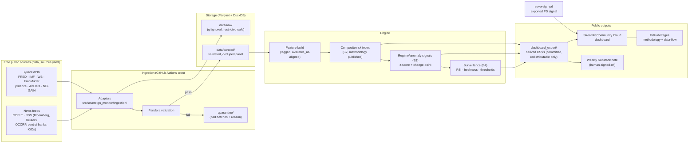

# SPEC.md — sovereign-monitor

> Version 1.0 — 2026-07-09. Scoped to ~4 focused hours/week. Companion repo:
> `sovereign-pd` (standalone probability-of-distress model; shares `data_sources.yaml`,
> otherwise independent). This spec covers Phase 0 through B6 of the phased plan.

---

## Problem statement

Sovereign-debt stress in South & Central Asia is consequential and under-monitored.
Sri Lanka's 2022 default, Pakistan's recurring IMF programs, Laos's and the Maldives'
China-linked debt loads, and Central Asia's exposure to Russia/China shocks all move
currencies, bond spreads, and the lives of roughly two billion people. The data to track
this stress exists — IMF, World Bank, FRED, BIS, AidData — but it is scattered across
dozens of portals, and the integrated view (spreads, FX, reserves, creditor exposure,
climate vulnerability, in one place) is locked behind Bloomberg terminals and paywalled
indices like J.P. Morgan's EMBI.

**sovereign-monitor is a transparent, reproducible sovereign-stress monitor built
entirely from free public data**: a documented composite risk index, statistical regime
signals, a surveillance/alert layer, and a live dashboard — every number traceable to an
open source and every method published. It feeds a weekly Substack research note. The
differentiator, and the first line of the README: an analyst-grade alternative to
paywalled terminals that anyone can reproduce from a `git clone`.

**Not** in this repo: supervised distress prediction. That is `sovereign-pd`'s job; this
monitor displays its exported signal but never trains on a distress label itself.

---

## Scope: countries and time range

| Set | Countries (ISO3) | Role |
|---|---|---|
| Scored — South Asia | PAK, LKA, BGD, NPL, MDV, IND | Full index + signals |
| Scored — Central Asia / China-sphere | KAZ, UZB, KGZ, TJK, MNG, LAO | Full index + signals |
| Drivers (unscored) | USA, CHN, EMU (Euro area), JPN | Context series only (rates, USD, growth) |

Time ranges (fullest available from these floors; per-series actual start dates are
documented in `docs/methodology.md`, never silently truncated):

- **Macro (annual/monthly):** from 2000-01-01.
- **Market (daily):** from 2000-01-01. Known later starts: EMB ETF (2007-12),
  EMLC (2010), EMHY (2012); ICE BofA EM OAS and ECB reference rates reach back past 2000.
- **News/events:** from project launch (2026-07). No backfill of news.

---

## Data sources

`data_sources.yaml` (schema_version 1, last_reviewed 2026-06-30) is the single source of
truth for endpoints, auth, cadence, and redistribution flags. Re-verify endpoints against
`meta.last_reviewed` before wiring — endpoints rot. The registry is copied into
`sovereign-pd`; keep `schema_version` in sync when it changes.

### v1 source subset

**Quant core (8):** `fred`, `frankfurter`, `yfinance`, `imf`, `worldbank_wdi`,
`worldbank_ids`, `aiddata_gcdf`, `nd_gain`.

**News core (6):** `gdelt`, `bloomberg_rss`, `reuters_via_gnews`, `occrp`,
`central_banks_rss`, `igo_press_rss`.

**Deferred to post-v1 (11):** `bis`, `eia`, `wb_pinksheet`, `wid`, `wb_pip`, `emdat`,
`ofac_sdn`, `opensanctions`, `occrp_aleph`, `lowy`, `bu_gdp_center`, `swf_open`.

### Grain and schema sketch

Two storage grains, one per ingestion layer:

**Quant observations** — long/tidy panel, one row per observation:

```
observation(
  source_id      text      -- registry id, e.g. "fred"
  series_id      text      -- provider series code, e.g. "BAMLEMCBPIOAS"
  country_iso3   text      -- "PAK" … ; "GLB" for global series
  date           date      -- reference date of the observation
  value          float
  ingested_at    timestamp -- when we pulled it
  available_at   date      -- when the value was publicly knowable (see leakage rules)
  batch_id       text      -- hash of (source_id, request window); idempotency key
)
PRIMARY KEY (source_id, series_id, country_iso3, date)
```

**News items** — metadata + link + our own summary, never full text:

```
news_item(
  source_id      text
  url_hash       text      -- sha256 of canonical URL; dedup key
  url            text
  title          text
  published_at   timestamp
  outlet         text
  summary_own    text      -- OUR summary, written/generated by us; never article body
  theme_tags     text[]    -- from registry theme taxonomy: empire, war, culture, fx, …
  country_iso3   text[]
  tone           float     -- GDELT tone where available, else null
  ingested_at    timestamp
  batch_id       text
)
PRIMARY KEY (source_id, url_hash)
```

### Target definition (B3 signals)

No supervised label. B3 produces two unsupervised signal families:

1. **Anomaly flags:** trailing rolling z-scores (window 252 trading days for daily
   series, 24 months for monthly) on the composite index, EM OAS proxy, and each scored
   country's FX pair; flag when |z| ≥ 2.5 for 3+ consecutive observations.
2. **Regime flags:** change-point detection (`ruptures`, PELT with RBF cost) on the same
   series; a regime break within the trailing 60 days flags the country "regime shift".

Evaluated against a hand-maintained **stress-event reference list**
(`docs/stress_events.yaml`: dated defaults, IMF program requests, currency crises,
reserve crashes for the 12 countries, 2000→present, each with a citation). Metrics:
flag precision/recall vs. reference events at 30/90-day tolerance, plus MAE-vs-naive
(random walk) for any point forecasts. Honest reporting: if the signals don't beat
naive, the model card says so.

### Leakage prevention (non-negotiable, tested in CI)

- Every observation carries `available_at` (publication date), distinct from `date`
  (reference date). Annual WDI/IDS data for year Y gets `available_at` ≈ Y+1 mid-year
  per the provider's release calendar; features join on `available_at`, never `date`.
- All rolling statistics use trailing windows only; no centered windows anywhere.
- Cross-validation is time-aware (expanding-window splits) — no shuffled K-fold on
  time-indexed data, ever.
- A mutation test in CI (see Testing) fails the build if any feature at time *t*
  changes when strictly-future rows are altered.

### Validation rules (Pandera, fail-loud)

Per-batch checks; a failing batch is quarantined, never ingested:

- **Schema:** column types, primary-key uniqueness, `value` non-null ≥ 99% per batch.
- **Ranges:** FX and prices > 0; OAS spreads in (0, 10 000) bps; index scores in [0, 100].
- **Freshness:** newest `date` in store ≤ 2 × source cadence old, else a freshness
  alert (WARN in B1, dashboard alert from B4).
- **Volume:** batch row count within [0.2×, 5×] of the trailing-10-batch median.

---

## Data & licensing register (v1 sources)

Derived from `data_sources.yaml`; that file remains canonical. **Storage policy is the
load-bearing column**: this is a public repo, so anything not re-publishable is kept in
gitignored local/runtime storage only, and only *derived* values (index scores,
z-scores, deltas) are ever committed.

| Source | Flag | License basis | Store policy | Attribution string |
|---|---|---|---|---|
| FRED (incl. ICE BofA EM OAS) | `restricted` | FRED ToS; ICE index data redistribution-restricted | Raw: local only, never committed. Derived stats: committable. | "Source: FRED®, Federal Reserve Bank of St. Louis. ICE BofA index data © ICE Data Indices, LLC — charted/derived, not redistributed." |
| Frankfurter (ECB rates) | `open` | ECB reference rates, free re-use | Store + commit freely | "FX: ECB reference rates via frankfurter.app" |
| yfinance (ETFs, FX) | `restricted` | Unofficial; Yahoo ToS | Raw: local only, never committed. Derived stats: committable. | "Market levels via Yahoo Finance (unofficial, best-effort)" |
| IMF (WEO/IFS/DSA) | `attribution` | IMF data ToS | Store + commit with citation | "Source: International Monetary Fund" |
| World Bank WDI | `attribution` | CC BY-4.0 | Store + commit with citation | "Source: World Bank, World Development Indicators (CC BY-4.0)" |
| World Bank IDS | `attribution` | CC BY-4.0 | Store + commit with citation | "Source: World Bank, International Debt Statistics (CC BY-4.0)" |
| AidData GCDF | `attribution` | ODC-BY / CC BY (per release) | Store + commit with citation | "Source: AidData Global Chinese Development Finance Dataset (latest release)" |
| ND-GAIN | `attribution` | Free with attribution | Store + commit with citation | "Source: University of Notre Dame Global Adaptation Initiative (ND-GAIN)" |
| GDELT | `open` (derived fields) | GDELT open data | GDELT-derived fields committable; **article text never stored** | "Event data: The GDELT Project" |
| Bloomberg RSS | `link_only` | Publisher content | Metadata + link + own summary only | Link to original article |
| Reuters via Google News RSS | `link_only` | Publisher content | Metadata + link + own summary only | Link to original article |
| OCCRP | `link_only` | Publisher content | Metadata + link + own summary only | Link to original article |
| Central-bank press feeds | `link_only` | Official releases | Metadata + link + own summary only | Link to release |
| IMF/WB/ADB/BIS press | `link_only` | Institutional releases | Metadata + link + own summary only | Link to release |

Deferred sources keep their registry flags and join this table when wired. The register
is re-audited whenever `meta.last_reviewed` passes its quarterly cadence.

---

## Architecture



Data flow in one sentence: scheduled GitHub Actions run the adapters, validated batches
land in the curated Parquet panel (bad batches quarantined), the engine builds
lag-aligned features → composite index → signals → alerts, and only redistributable
derived artifacts are committed to `dashboard_export/` for the Streamlit dashboard and
the weekly note.

Because the repo is public and hosting is billing-free, there is no persistent server:
**GitHub Actions is the scheduler, the git repo is the artifact store (derived data
only), and Streamlit Community Cloud reads committed CSVs.** Raw data (including
restricted series) exists only inside a job run or on the local machine.

---

## Tech stack

| Choice | Why (one line) |
|---|---|
| Python 3.11+ | Project convention; modern typing without back-compat baggage. |
| `uv`-managed `pyproject.toml` | Single-file dependency + tool config; fast, lockfile-reproducible. |
| `ruff` + `mypy` + `pre-commit` | Project convention; catches errors before CI. |
| `pytest` | Project convention; fixtures suit recorded-response adapter tests. |
| `pydantic-settings` | Typed config from `.env`; no hard-coded paths or secrets. |
| `structlog` | Structured logging convention; machine-parseable run logs. |
| `httpx` + `feedparser` + `sdmx1` | REST, RSS, and SDMX (IMF) access respectively — the three access patterns in the registry. |
| Pandas + Pandera | Panel manipulation with fail-loud schema validation at every boundary. |
| Parquet + DuckDB | Columnar store queried in-place with SQL; zero server, zero billing. |
| `ruptures` | Standard change-point library for B3 regime detection. |
| MLflow (local only) | Project convention for experiment tracking; never a hosted service. |
| Streamlit (Community Cloud) | Free public hosting, no card; fastest path to an interactive dashboard. |
| GitHub Actions + Pages | Free scheduling and static hosting for public repos — the whole "no billing" backbone. |
| Multi-stage Dockerfile | Project convention; reproducible local runs mirror CI. |

Reuse note: the Phase 0 template (pyproject, lint/test CI, config, logging, adapter
base classes) is deliberately generic and gets reused as the skeleton for `sovereign-pd`.

Conventions binding all code (from global standards): full-English-word names with
underscores; file- and function-purpose comments explaining *why*; error messages as
`sovereign-monitor: message` (lowercase, no trailing period); the CLI supports
`--version` and `--help`; user-visible changes logged in `NEWS.md`.

---

## Lifecycle stages

Each stage maps to a phase of the plan, with deliverables and acceptance checks.
Calendar assumes ~4 hrs/week from 2026-07-09.

### 0. Scaffold — Phase 0

Deliverables: `pyproject.toml` with ruff/mypy/pre-commit; pytest wired; `Makefile`
(`setup`, `lint`, `test`, `ingest`, `build-index`, `dashboard`, `issue-pack`);
multi-stage `Dockerfile`; `.github/workflows/ci.yml` (lint + test); `pydantic-settings`
config; structlog setup; `.env.example`; one RSS adapter (Bloomberg) and one API adapter
(FRED) landing into local Parquet.

Acceptance: CI green on push; `make ingest SOURCE=bloomberg_rss` and
`make ingest SOURCE=fred` land rows into `data/raw/` and `data/curated/` locally.

### 1. Ingestion & storage — B1

Deliverables: adapters for all 14 v1 sources (feedparser RSS, GDELT DOC API, FRED REST,
World Bank REST, IMF SDMX, Frankfurter, yfinance, AidData/ND-GAIN bulk CSV); idempotent
incremental pulls keyed on `batch_id` with upsert on natural key; Pandera schemas +
freshness/null/volume checks; quarantine path writing failed batches +
`reason.json`; scheduled workflows (`ingest_market_news.yml` daily 03:00 UTC,
`ingest_macro.yml` weekly Mon 04:00 UTC) committing derived exports back to the repo.

Acceptance (B1 DoD): a scheduled run lands validated, deduped data with zero manual
steps; re-running the same window is a no-op (idempotency test); a deliberately
malformed batch ends up in `quarantine/`, not the panel.

### 2. Processing & index — B2

Deliverables: feature build with `available_at` alignment and lag discipline; the
composite sovereign-stress index — four pillars, equal-weighted in v1
(**market**: EM OAS proxy level+Δ, FX depreciation + realized vol;
**external debt**: debt/GNI, PPG service/exports, share owed to China from IDS;
**macro**: growth, inflation, current account, reserves in import-months;
**climate**: ND-GAIN vulnerability), each indicator winsorized at 1/99 and min-max
scaled to [0, 100] across the 12-country panel from 2000; monthly index with a daily
market-pillar overlay; `docs/methodology.md` published to GitHub Pages.

Acceptance (B2 DoD): index time series exists for all 12 countries; the methodology
page lets a reader recompute any month's score by hand; the index chart renders from
`dashboard_export/`.

### 3. Signals & evaluation — B3

Deliverables: anomaly + regime flags as specified under *Target definition*;
`docs/stress_events.yaml` reference list; expanding-window backtest; MLflow-tracked
runs; model card (`docs/model_card.md`) with honest precision/recall vs. tolerance
windows and MAE-vs-naive.

Acceptance (B3 DoD): backtest reproduces from one command
(`make backtest`); model card states where signals beat naive and where they don't;
leakage mutation test passes in CI.

### 4. Monitoring — B4

Deliverables: input drift (PSI vs. trailing-12-month baseline per indicator);
freshness/staleness alerts; threshold alerts (index Δ ≥ 10 points/month, |z| ≥ 2.5);
alert log written to `dashboard_export/alerts.csv` with fired_at/rule/series/value.

Acceptance (B4 DoD): a test with a deliberately shifted input fires a PSI alert
end-to-end; the alert appears in the dashboard alert log.

### 5. Serving — B5

Deliverables: public Streamlit app — index heatmap + per-country time series,
spreads/FX panel, debt-to-China exposure view (IDS + AidData), climate vulnerability
view, alert log, `sovereign-pd` signal panel (display-only), link to latest issue;
auto-refreshes from committed exports on each scheduled run.

Acceptance (B5 DoD): public URL, no login, auto-refreshing, linked from Substack.

### 6. Polish — B6

Deliverables: README leading with the differentiator + architecture diagram +
screenshots; `docs/data_flow.md`; licensing register audited; `NEWS.md` current.

Acceptance (B6 DoD): a stranger groks the project in ~90 seconds from the README alone.

---

## Publishing workflow (Track A)

- **Cadence:** weekly, Thursdays. **First issue: Thursday 2026-07-23 — hard milestone.
  Engine work must never block it**; the first issue is hand-written and lightly tooled
  (2–3 series pulled by notebook: FRED EM OAS, FX pairs, one IMF/WB indicator; manual
  GDELT/Bloomberg/Reuters/OCCRP collection).
- **Template (locked in Track A1):** headline read → "what moved" spreads/FX table →
  1–2 country spotlights → empire/war/culture lens → chart of the week → sourced links →
  disclaimer.
- **AI-assist boundary:** a free local LLM model may summarize factual data deltas and draft prose from
  `make issue-pack` output (tables + flagged movers + candidate links). A human
  supplies judgment, verifies numbers against the dashboard, and signs off before
  publishing. Nothing publishes without human sign-off.
- **Ratchet rule (Track A3):** every issue after the first retires exactly one manual
  step by pulling the corresponding Track B capability forward.
- **Disclaimers:** every issue ends with the not-investment-advice disclaimer and full
  source attributions; news is always linked, never reproduced.

---

## Compliance & disclaimers

- **Disclaimer everywhere:** "This is a research and educational project. Nothing here
  is investment advice." — footer of every issue, dashboard page, and docs page.
- **News is `link_only`:** metadata + link + our own summary. Article bodies are never
  stored, committed, or republished. GDELT-derived fields are fine; GDELT's source
  article text is not.
- **Restricted series** (ICE BofA via FRED, yfinance, later EM-DAT): chart and derive
  only; raw values never committed to the public repo or re-hosted. The methodology
  page states plainly that no free EMBI/CEMBI exists and FRED's ICE BofA EM OAS is the
  index proxy.
- **Attribution:** every chart and table carries the register's attribution string.
- **Secrets:** API keys (FRED, EIA later) in `.env` locally, GitHub Actions secrets in
  CI, Streamlit secrets on the dashboard. Never committed; `.env.example` documents keys.
- **Register accuracy is a DoD item:** the licensing table above must match
  `data_sources.yaml` at release.

---

## Repo structure

```
sovereign-monitor/
├── pyproject.toml               # deps + ruff/mypy/pytest config (uv-managed)
├── Makefile                     # setup / lint / test / ingest / build-index / backtest
│                                #   / dashboard / issue-pack
├── Dockerfile                   # multi-stage: builder + slim runtime
├── NEWS.md                      # user-visible changes, newest first
├── data_sources.yaml            # canonical source registry (shared with sovereign-pd)
├── .env.example                 # documented keys; real .env is gitignored
├── .github/workflows/
│   ├── ci.yml                   # lint + mypy + pytest on push/PR (no network)
│   ├── ingest_market_news.yml   # daily 03:00 UTC: quant-daily + news adapters
│   └── ingest_macro.yml         # weekly Mon 04:00 UTC: IMF/WB/bulk sources
├── config/
│   └── countries.yaml           # scored set, drivers, per-country series mappings
├── src/sovereign_monitor/
│   ├── __main__.py              # CLI entry: ingest/validate/build-index/signals/
│   │                            #   surveil/export — supports --version/--help
│   ├── configuration.py         # pydantic-settings
│   ├── logging_setup.py         # structlog config
│   ├── ingestion/               # base adapter + one module per access pattern
│   │   ├── base.py              # batch_id, idempotent upsert, quarantine hook
│   │   ├── rss_feeds.py         # Bloomberg, Reuters-via-GNews, OCCRP, banks, IGOs
│   │   ├── gdelt.py             # GDELT DOC API
│   │   ├── fred.py / worldbank.py / imf_sdmx.py / frankfurter.py
│   │   ├── yfinance_prices.py
│   │   └── bulk_csv.py          # AidData, ND-GAIN
│   ├── schemas/                 # Pandera: observation, news_item, index, alerts
│   ├── storage/                 # parquet read/write, DuckDB views, quarantine
│   ├── features/                # available_at alignment, lagging, transforms
│   ├── index/                   # pillar construction, scaling, composite
│   ├── signals/                 # z-score anomalies, ruptures change-points, backtest
│   └── surveillance/            # PSI, freshness, threshold rules, alert log
├── dashboard/
│   └── streamlit_app.py         # reads dashboard_export/ only
├── dashboard_export/            # committed derived CSVs — redistributable values ONLY
├── data/                        # gitignored: raw/ curated/ quarantine/
├── docs/                        # GitHub Pages: methodology.md, data_flow.md,
│                                #   model_card.md, stress_events.yaml
├── newsletter/                  # issue template, per-issue checklist, issue-pack output
├── notebooks/                   # Track A1 manual pulls; exploratory only, not imported
└── tests/                       # unit + fixtures/ (recorded API/RSS responses)
```

---

## Testing & CI strategy

CI (`ci.yml`) runs `ruff check`, `mypy`, and `pytest` on every push/PR — **no live
network calls in CI**; every adapter test replays recorded fixtures.

What is tested:

- **Adapters:** each parses its recorded fixture into schema-valid rows; malformed
  fixture → quarantine, not raise-and-die.
- **Idempotency:** ingesting the same fixture batch twice yields identical row counts.
- **Validation:** Pandera catches planted nulls, range violations, and volume spikes;
  the quarantine path writes batch + `reason.json`.
- **Leakage/look-ahead (the non-negotiable):** build features on a synthetic panel,
  mutate strictly-future rows, assert every feature value at time *t* is unchanged;
  plus a test that CV split boundaries never leak future rows into training windows.
- **Index:** a hand-computed toy panel reproduces the documented pillar math exactly
  (this is the "recompute by hand" guarantee behind the methodology page).
- **Surveillance:** a synthetically shifted input distribution fires the PSI alert
  (mirrors the B4 DoD).
- **Registry:** `data_sources.yaml` parses, flags are in the allowed enum, and every
  wired adapter's `source_id` exists in the registry.

Scheduled ingestion workflows are the only place live calls happen; each run uploads
logs as an Actions artifact and fails loudly (workflow failure = red badge) rather than
committing partial data.

---

## Definition of done (v1)

Objective and verifiable; target date 2026-11-13:

- [ ] **First Substack issue published by 2026-07-23** (hard milestone), weekly since.
- [ ] CI green; `ruff`, `mypy`, `pytest` all pass; pre-commit installed.
- [ ] `make all` (or `docker run`) executes ingest → validate → index → signals →
      export end-to-end from one command.
- [ ] Scheduled GitHub Actions runs land validated, deduped data with zero manual steps;
      a bad batch quarantines instead of ingesting.
- [ ] Composite index live for all 12 countries with a published methodology page that
      permits hand-recomputation.
- [ ] Backtested signal with model card reporting honest metrics vs. naive.
- [ ] Surveillance alert demonstrably fires on a deliberately shifted input and shows in
      the dashboard alert log.
- [ ] Public auto-refreshing dashboard URL on Streamlit Community Cloud, linked from
      Substack, showing index, spreads/FX, China exposure, climate, alerts, and the
      `sovereign-pd` signal.
- [ ] README leads with the differentiator + architecture diagram + screenshots; a
      stranger groks it in ~90 seconds.
- [ ] Licensing register accurate against `data_sources.yaml`; no restricted raw data
      anywhere in git history; every chart attributed.
- [ ] Leakage mutation test present and passing in CI.

---

## Stretch goals (explicitly post-v1)

- Wire the 11 deferred registry sources — BIS effective FX rates, EIA energy,
  Pink Sheet commodities, WID/PIP inequality, EM-DAT disasters, OFAC/OpenSanctions,
  Lowy, BU GDP Center, SWF fragments, OCCRP Aleph.
- Deeper `sovereign-pd` integration: index features exported for its model, joint
  model-card cross-references (still separate repos).
- Alert notifications (GitHub Issues auto-filed or RSS feed of alerts — still no
  paid services).
- Country-page deep links in the weekly issue generated from `issue-pack`.
- Learned (non-equal) pillar weights with documented sensitivity analysis.
- Nowcasting reserves/FX pressure from news tone (GDELT) — research track, only after
  B3's honest-metrics bar is met.
